<!-- HERO -->
# Art & Science in Motion - Living Mathematics 💎🌀♾️🌌 ✨
[](https://teses.usp.br/teses/disponiveis/3/3151/tde-20102010-122044/en.php)
[](https://arxiv.org/abs/2504.01969)


 
     

**PT · EN · ES** · [Galeria](#galeria--gifs) · [Instalação](#instalação--installation--instalación) · [Apache License](#licença--license--licencia)

---
## Math-Dynamics
A collection of visualizations exploring the behavior of dynamic systems, chaotic attractors, and financial models, implemented in Python with Matplotlib and SciPy.  inspired by fractal aesthetics and mathematical harmony. Authored by Ana Isabel Castillo, PhD in Applied Mathematics. 

# ⚡ Tesla 3D Electromagnetic Field – Visual Tribute

> “Yesterday (07/07/25), the YouTube algorithm gifted me with a revealing interview about the genius Nikola Tesla.  
> I was captivated… and ideas flowed like electricity in the air.  
> Thus, this tribute was born: a creative spark that ignited, echoing Tesla’s vision that lit up the world.  
> His boldness inspired me to transform energy and frequency into visual art.”  
> — **Isabel  – Math Dynamics✨**

## 🎥 Project
This is a 3D simulator inspired by Nikola Tesla’s revolutionary ideas, capturing pulsating electromagnetic fields with zeta-shaped rays rising and falling like cones, evoking his genius in alternating current and wireless energy transmission. Created with Python and Matplotlib, the project blends science and visual art, featuring a vortex spiral and a subtle base tremor to reflect Tesla’s creative instability.

🎬 Watch the animation:  [Tesla 3D Animation](campo_eletromagnetico_tesla_3d_vibes.mp4)  
-
 
📄 Presentation: [NikolaTesla PDF](NikolaTesla.pdf)  
© 2025 – Original project by Ana Isabel C. – Math Dynamics  
All rights reserved. Sharing only with proper credits. 
# Site: https://github.com/IsabelCasPe/Math-Dynamics.git

## Hofstadter Butterfly 🦋
The Hofstadter butterfly is a fractal spectrum that emerges from the Harper equation (1974), describing electrons in a 2D lattice under a magnetic field.
It beautifully connects quantum mechanics, number theory, and fractals, showing how simple periodic systems can generate highly complex structures.
This project reproduces a visualization of the butterfly using Python + NumPy + Matplotlib, animating the spectrum as it builds up from the flux ratio (α) and energy levels (ε).

# ✨ Features:
1. Implementation of Harper’s tight-binding model
2. Animation of the fractal spectrum building “bottom-up”
3. Twinkling background stars for a cosmic touch.
   
(Fun fact: mathematicians took decades (and many martinis 🍸) to tame this fractal beast… here it’s simulated in about an hour of coding. 👾) @IsabelCasPe 💃 💙
- [Hofstadter Butterfly PDF](Hofstadter.pdf) 
- **Visualizations**: 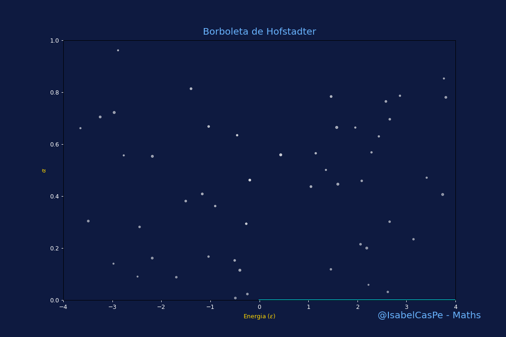
[Read more at Quanta Magazine](https://www.quantamagazine.org/ten-martini-proof-uses-number-theory-to-explain-quantum-fractals-20250825/?fbclid=IwY2xjawM0VdpleHRuA2FlbQIxMABicmlkETFJWE1Ha0VXSFlUcWp1NTVjAR4r9yNok6Pm56aBHpIcVSQDlpOy4VdFBbFE5Xe0RVdwHeok31XJmH3U1WJWlg_aem_jHOuBw8h_CCOm5Itp7KQ1w)

# Math-Dynamics: Quantum Sphere Dynamics & Numerical Calculus
- **Python Codes**:
- #Sphere Dynamics
- [Quantum Sphere PDF](esferaquanticadf.pdf)
- **Visualization**:  1521 squares dance in spectral, building a 3D sphere with the elegance of Laplace's equation
---
## Sólido de Revolução. 🪩
- 

---
## Da série dos absurdos, meu cilindro quântico!
O volume exato desse cilindro giram meus dados🎲.  Estatística limpa, Machine Learning prevê, Sistemas Dinâmicos bota o caos, e Finanças Quânticas fecha com risco sistêmico. 😎
- 
- 
---

## Birthday Celebration: Quantum Flower of Life
The **Quantum Flower of Life** is a 3D visualization celebrating my birthday and resilience in the chaotic world of *Finance Math*. Key features:
- **Surface**: Defined by \( z = g \cdot p \cdot \sin(6\theta) \cos(3r) \), with organic growth \( g = \min(1.5, t/50) \cdot e^{-0.5 r^2} \) and pulsing petals \( p = 1.2 + 0.7 \sin(t/20) \).
- **Root**: Solution to \( \sin(\cos(\sqrt{3}x)) = 0 \), with \( x \approx 0.9166 \), visualized as a pulsating *goldlove* point.
- **Stars**: 50 white stars , with dynamic size and transparency, pulsing.
- **Base**: Oscillating 3D base (*Sábana Gaussiana*) in *cosmicgray* , defined by \( z = 0.1 \sin(2\pi (x + y)/5 - t/20) \).
- **Connection to QFE**: Inspired by the Anderson model and nonlinear dynamics in financial chaos (e.g., GOLL4.SA).

The LaTeX presentation [flordavida PDF](flordavida.pdf) provides a rigorous mathematical foundation.

  - `birthday_quantum_flower_v9.py`
- **Video**: [Quantum Flower of Life v9](birthday_quantum_flower_v9.mp4) – Updated animation with enhanced dynamics.
- **Presentation**: [Quantum Flower of Life PDF](flordavida.pdf) – LaTeX slides detailing the mathematical formulation.
- **Visualizations**:
For my birthday on July 4, 2025, I present the **Quantum Flower of Life**: a 3D visualization with 1156 Spectral grid points, blooming petals, radiant white stars, and the root \( x \approx 0.9166 \) 

## Acknowledgments
- To Loki, for throwing shade at the haters © Ana Isabel Castillo & Loki, 2025
- To the *Math-Dynamics* community for the vibrant support!

# Schrödinger 3D – Math-Dynamics 🎥✨

Interactive and artistic visualization of the 3D Schrödinger equation with a quasi-periodic potential, inspired by just 10 minutes of a lecture.
This project blends science, art, and aesthetic sensitivity into a single dynamic flow.

🔸 Included Files
🎞️ schrodinger_3dv29.mp4: Full animation of a golden quantum particle dancing through the 3D quantum field. [schrodinger_3dv29.mp4](schrodinger_3dv29.mp4)
- 

📄 Schrodinger3D2A.pdf: LaTeX Beamer presentation describing the simulation and its mathematical–visual connections. 
- [Schrodinger3D2A PDF](Schrodinger3D2A.pdf)

## Sabana Gaussiana Quântica: 
- **Visualization**:   In a world of uncertainty, even the wave rests on a savanna of probabilities. This is the quantum dance of the universe: subtle, undulating, and profoundly beautiful.
  
## Oscillatory Systems
### Sine and Cosine Oscillations
Visualization of harmonic functions \(\sin(x+t)\) and \(\cos(x+t)\), demonstrating periodic motion.  
- **Specifications**: 10,000 points; Matplotlib animation.  
- **Visualization**: 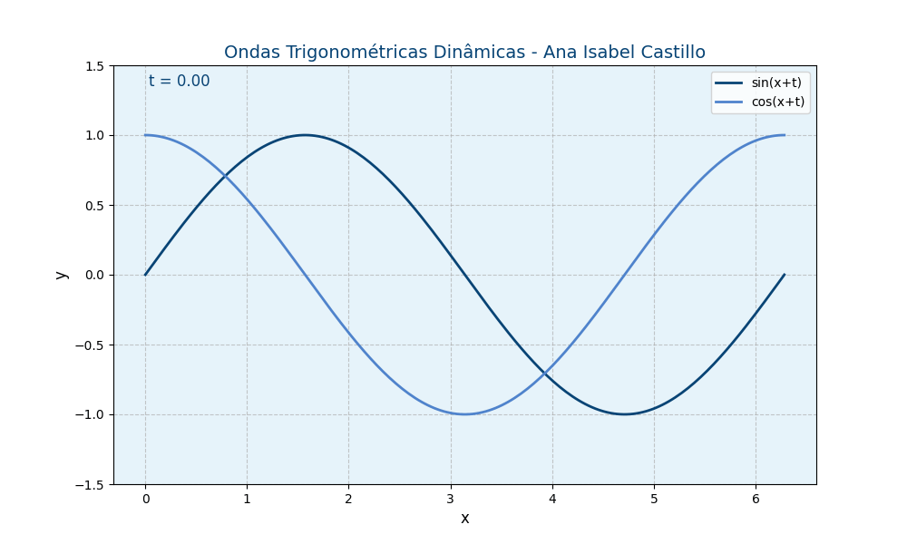  
- **Description**: Parametric oscillations in two dimensions.

### Lissajous Curves
Parametric oscillations generating Lissajous curves, forming harmonic patterns.  
- **Specifications**: Frequencies `a=3`, `b=2`, phase `phi=π/2`; 10,000 points; Matplotlib animation.  
- **Visualization**:   
- **Description**: Trajectories defined by \(x = \sin(a t + \phi)\), \(y = \sin(b t)\).

### Heart-Shaped Parametric Dynamics
Curves forming heart-shaped orbits, inspired by parametric equations.  
- **Specifications**: Parametric equations with 10,000 points; Matplotlib animation.  
- **Visualization**:   
- **Description**: Oscillatory patterns evoking dynamic harmony.

### Duffing Oscillator
Nonlinear oscillator exhibiting complex behavior, visualized as a sea wave.  
- **Specifications**: Parameters for chaotic regime; Matplotlib animation.  
- **Visualization**:   
- **Description**: Solutions to the Duffing equation with nonlinear restoring force.

## Chaotic Systems
### Logistic Map
Visualization of the logistic map, transitioning from periodicity to chaos.  
- **Specifications**: Parameter \(r\) varying across grid; Matplotlib animation.  
- **Visualization**: 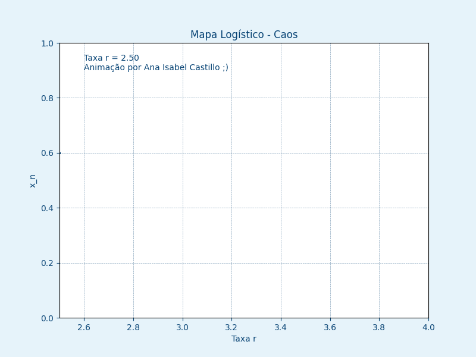  
- **Description**: Discrete iterations \(x_{n+1} = r x_n (1 - x_n)\).

### Lorenz Attractor
Trajectories of the Lorenz system, a continuous chaotic attractor with spiral dynamics.  
- **Specifications**: Parameters \(\sigma=10\), \(\rho=28\), \(\beta=8/3\); 10,000 points; `odeint` integration.  
- **Code**: [lorenz.py](lorenz.py)  
- **Visualization**:   
- **Description**: System defined by \(\dot{x} = \sigma(y-x)\), \(\dot{y} = x(\rho-z)-y\), \(\dot{z} = xy-\beta z\).

### Lorenz Particles
Two particles evolving within the Lorenz attractor, highlighting chaotic divergence.  
- **Specifications**: Initial conditions offset by 0.01; Matplotlib animation.  
- **Visualization**: 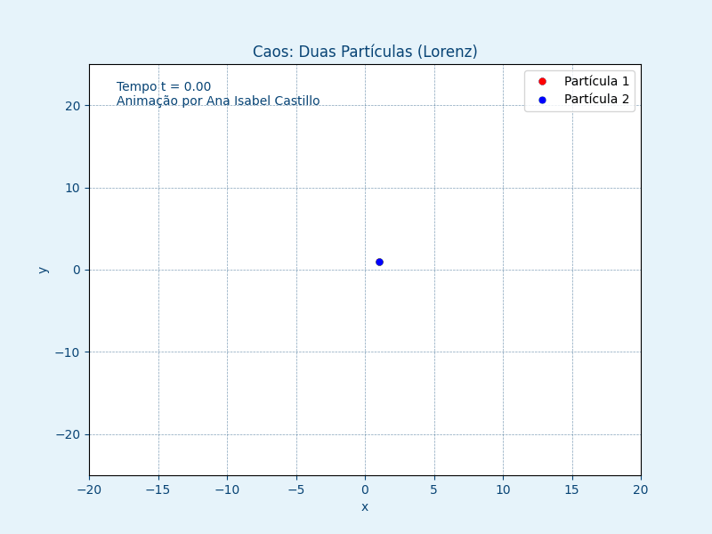  
- **Description**: Sensitivity to initial conditions in chaotic systems.

### Hénon Map
Discrete chaotic system generating dense orbits in a confined region.  
- **Specifications**: `a=1.4`, `b=0.3`; 10,000 points; Matplotlib scatter plot.  
- **Visualization**: 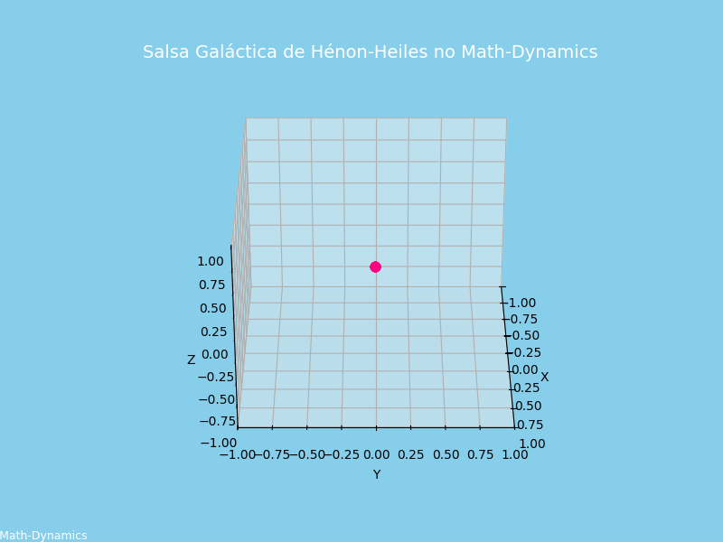  
- **Description**: Iterations \(x_{n+1} = 1 - a x_n^2 + y_n\), \(y_{n+1} = b x_n\).

- **Hénon Map 3D**: Fractal chaos with two trajectories.
  - **GIF**: 
  - **Video**: [henon_salsa_fractal.mp4](henon_salsa_fractal.mp4)
  - **Documentation**: [Henon2 PDF](Henon2.pdf)
  - **Code**: [henon_salsa_fractal.py](henon_salsa_fractal.py)

### Rössler Attractor
Continuous chaotic system with dense spiral trajectories.  
- **Specifications**: `a=0.2`, `b=0.2`, `c=7.0`; 20,000 points; `odeint` integration.  
- **Visualization**: , 
- **Documentation**: [Rossler1 PDF](Rossler1.pdf)
- **Description**: System defined by \(\dot{x} = -y-z\), \(\dot{y} = x + a y\), \(\dot{z} = b + z(x-c)\).

### Quasiperiodic Toro
Three-dimensional quasiperiodic flow on a torus, exhibiting non-repeating orbits.  
- **Specifications**: Incommensurate frequencies; Matplotlib 3D animation.  
- **Visualization**:   
- **Documentation**: [quaseperiodicotoro PDF](quaseperiodicotoro.pdf)  
- **Description**: Trajectories on a toroidal manifold.

- **Double Pendulum**: Chaotic dynamics simulation.
- **GIF**: 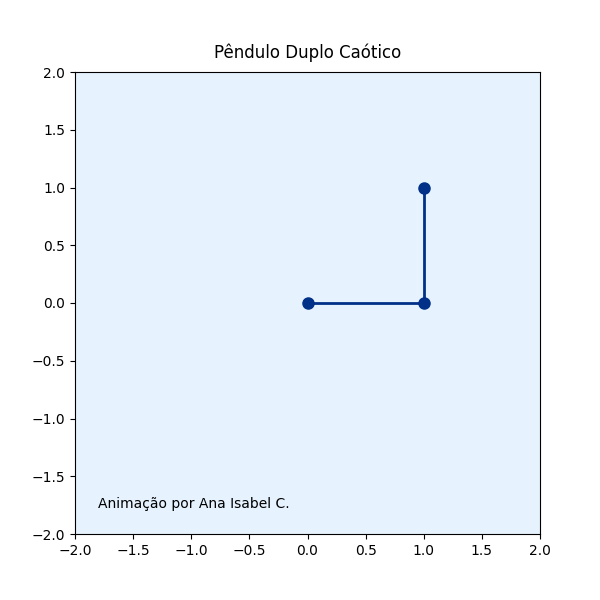
- **Documentation**: [Penduloduplo PDF](Penduloduplo.pdf)
- **Code**: [pendulo_duplo.py](PenduloDuplo/pendulo_duplo.py)

## Financial Models
### Black-Scholes Model
Visualization of call option pricing under the Black-Scholes model with varying volatility \(\sigma\).  
- **Specifications**: Matplotlib animation with dynamic \(\sigma\).  
- **Visualization**: 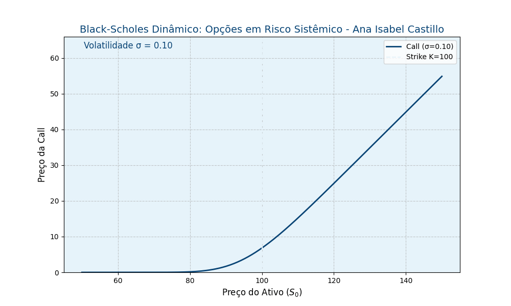  
- **Description**: Solution to the Black-Scholes PDE for option pricing.

### Black-Scholes Interactive
Interactive visualization of Black-Scholes pricing with adjustable volatility.  
- **Specifications**: Slider for \(\sigma\); Matplotlib interactive plot.  
- **Visualization**:   
- **Description**: Dynamic exploration of option pricing.

### Heston Model
Stochastic volatility model simulating price and volatility dynamics.  
- **Specifications**: Monte Carlo simulation; Matplotlib animation.  
- **Visualization**: 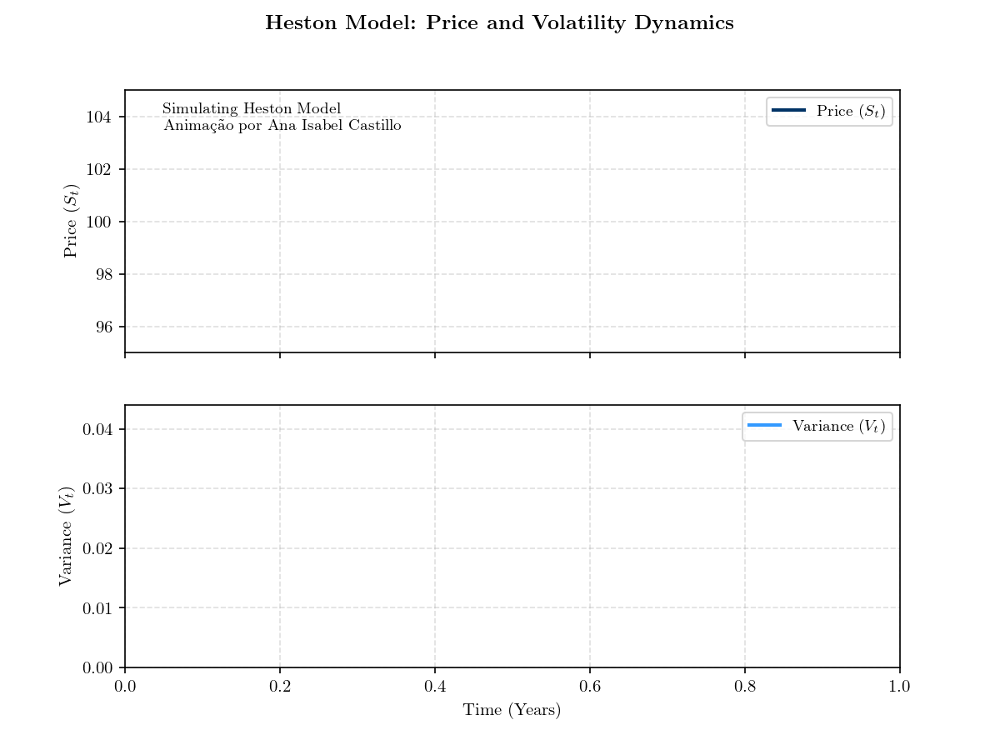  
- **Description**: Coupled stochastic differential equations for asset price and variance.

## Transform Methods
### Fourier Transform
Decomposition of signals into frequency components via the Fourier transform.  
- **Specifications**: Matplotlib animation of frequency summation.  
- **Visualization**: 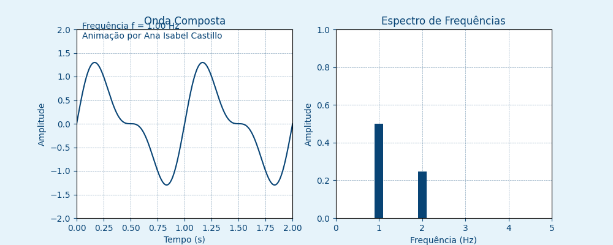  
- **Description**: Representation of signals as sums of sinusoids.

### Laplace Transform
Visualization of exponential decay in the \(s\)-domain, applied to control and finance.  
- **Specifications**: Matplotlib animation of transform dynamics.  
- **Visualization**: 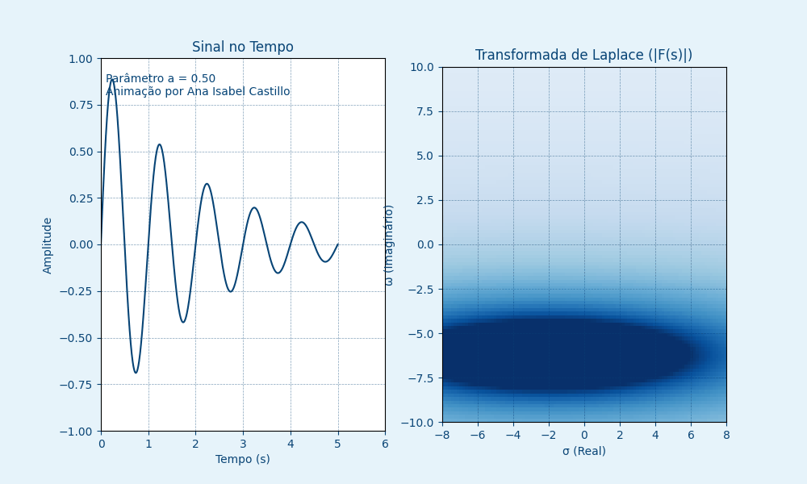  
- **Description**: Transform mapping time-domain signals to the complex plane.

## Fractal Systems
### Julia Set
Animation of the Julia set, exploring complex dynamics in the complex plane.  
- **Specifications**: Iterations in complex plane; Matplotlib animation.  
- **Visualization**: 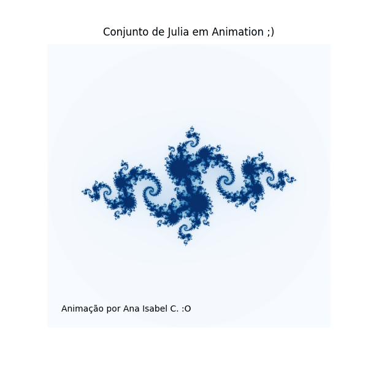
- **Documentation**: [JuliaDynamics.pdf](JuliaDynamics.pdf) 
- **Description**: Fractal boundaries defined by \(z_{n+1} = z_n^2 + c\).

## Numerical Methods
### Euler Method
Visualization of numerical solutions using the Euler method for differential equations.  
- **Specifications**: Matplotlib animation of iterative steps.  
- **Visualization**: 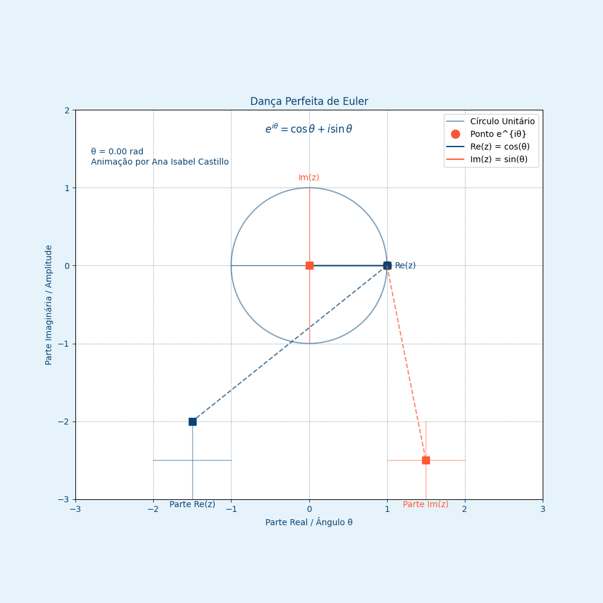  
- **Description**: Approximation of ODE solutions via discrete steps.

## Optimal Control
### Linear Quadratic Regulator (LQR)
Optimal control visualization for a dynamic system, minimizing a quadratic cost.  
- **Specifications**: Matplotlib animation of state trajectories.  
- **Visualization**: 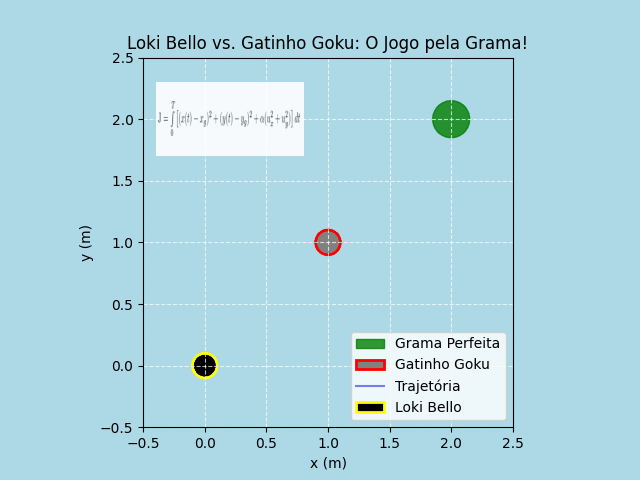
- **Documentation**: [LQRLoki PDF](LQRLoki.pdf) 
- **Description**: Control law derived from Riccati equation solutions.
---

## Henri Poincaré (1854–1912) foi um matemático, físico e filósofo francês. Criou a topologia algébrica e formulou a Conjectura de Poincaré, um dos Problemas do Milênio, resolvido apenas em 2006. ♾️💎
-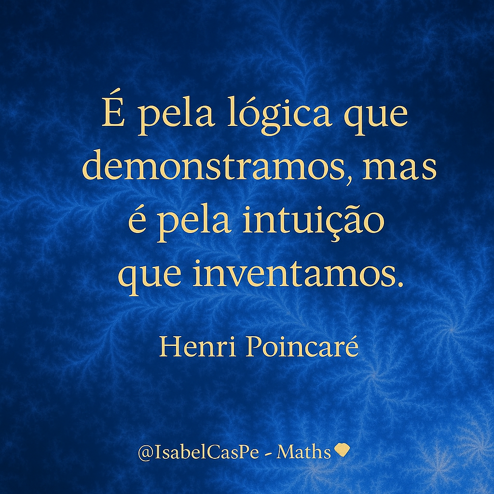

---
## Usage
- View GIFs for looped animations directly in the browser.
- Source codes and additional documentation available upon request for academic purposes.
- Visualizations are implemented in Python with Matplotlib and SciPy.

## License
© Prof. Ana Isabel Castillo, Math-Dynamics. Licensed under [Apache License](LICENSE.md).

## Contributions
Suggestions for new dynamic systems or visualization techniques are welcome. Contact the author for collaboration or additional materials.

----
## Inspiration: 

> **"In the chaos of numbers, the universe’s dance reveals its infinite harmony - @MathDynamics, science in motion, where science finds its own music."** 🌐
>     © Copyright. Prof. Ana Isabel Castillo 💙 
---
## Instalação · Installation · Instalación

<p align="center">
  
</p>

<p align="center">
  <sub><b>@IsabelCasPe</b> 💙✨ — <i>Cosmos em código: ciência que vira arte.</i> 💎♾️</sub>
</p>

```bash

python -m venv .venv && source .venv/bin/activate
pip install -r requirements.txt
python main.py
